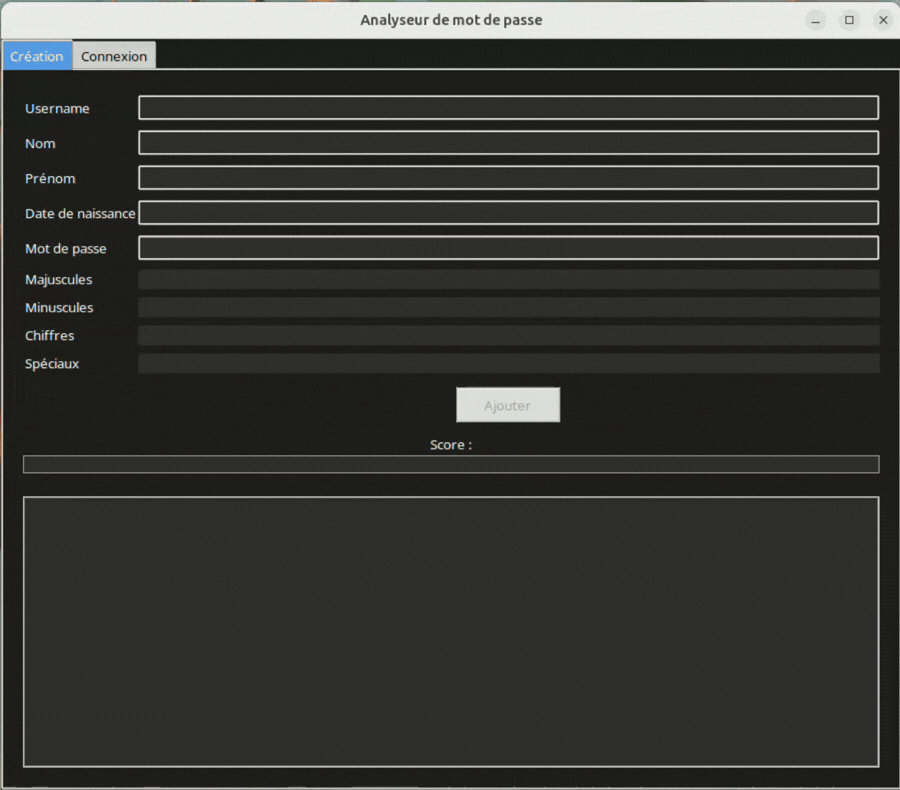
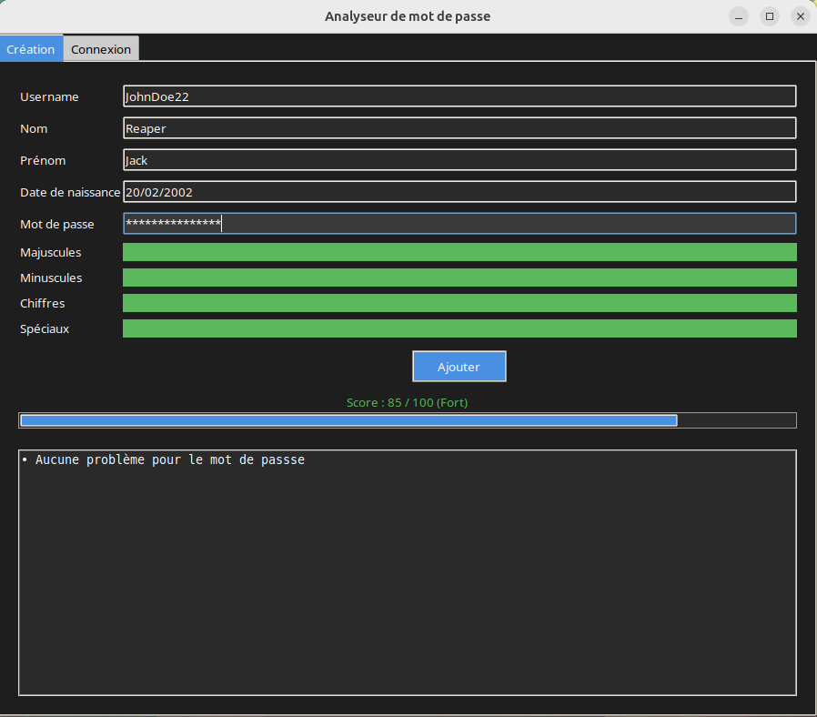
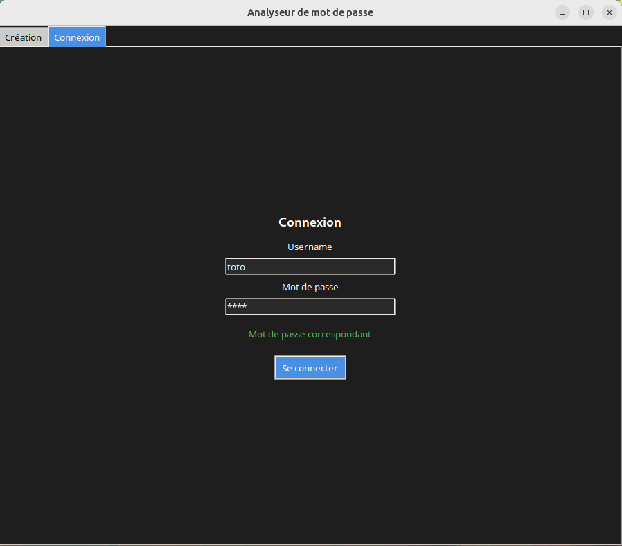
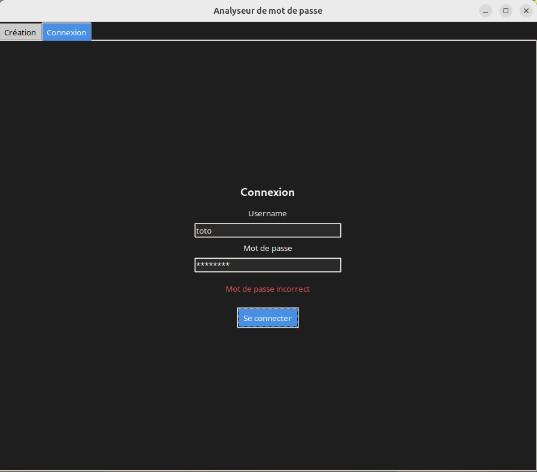
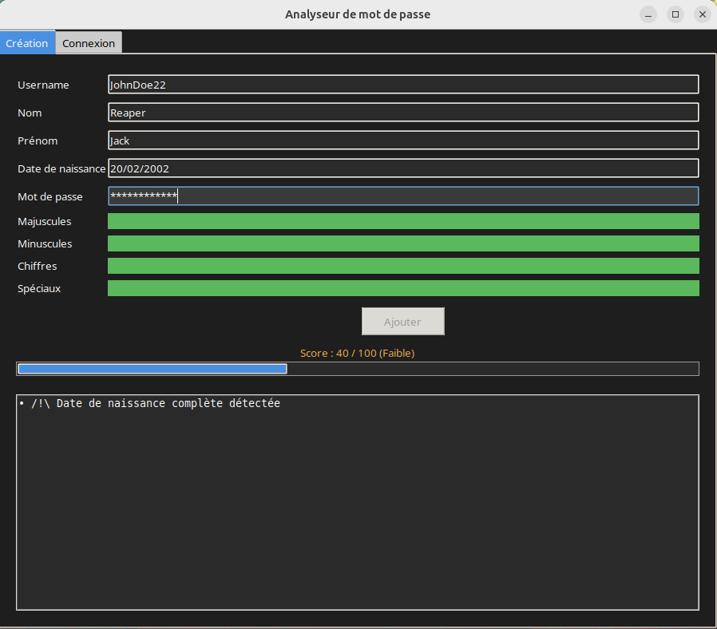

# Verificateur de mot de passe local

Ce vérificateur de mot de passe est un projet personnel orienté **cybersécurité**, permettant de tester la robustesse d’un mot de passe, de le **hasher** et de le stocker de manière sécurisée en local.

Ce projet est développé en **Python** et propose à la fois :

- une version **console**
- une interface graphique avec **Tkinter**

---

# Aperçu du projet



Ce projet permet :

- de **créer un mot de passe**
- d’obtenir un **score de sécurité**
- d’avoir un **retour détaillé sur sa robustesse**
- de **stocker le hash du mot de passe** en base locale
- de vérifier si un mot de passe est **déjà enregistré**

---

# Objectifs

Ce projet a pour but de mettre en pratique des concepts de **sécurité informatique**, notamment :

- le **hashage sécurisé des mots de passe**
- l’évaluation de la **complexité d’un mot de passe**
- l’utilisation de **dictionnaires de mots de passe faibles**
- le stockage sécurisé avec une base de données locale
- la séparation des responsabilités dans un projet Python

---

# Technologies utilisées

- **Python**
- **Tkinter** – interface graphique
- **SQLite** – base de données locale
- **zxcvbn** – estimation de la robustesse des mots de passe
- **argon2-cffi** – hashage sécurisé des mots de passe

---

# Fonctionnalités

## Vérification de mot de passe

- analyse de la complexité
- détection de mots de passe faibles
- score de sécurité

## Stockage sécurisé

- hashage du mot de passe (aucun stockage en clair)
- enregistrement dans une base SQLite

## Vérification d'existence

- comparaison du hash avec ceux présents en base
- permet de simuler une authentification locale

## Interface graphique

***Uilisation de l'ia pour la partie interface graphique***

---

# Structure du projet

Voici les parties composant ce projet 

```
.
├── client.py #Version minimale du vérificateur en console
├── database.db #Base de données de stockage des mots de passe
├── database.py #Fonctions pour interagir avec la base de données
├── feedback.py #Fonctions pour les messages de retour sur le mot de passe
├── hashing.py #Fonctions pour hasher le mot de passe
├── interface.py #Tkinter pour l'interface graphique 
├── main.py 
├── score.py #Fonctions pour les différents calcul de score 
└── verif_dico.py #Fonctions avec zxcvbn pour vérifier avec des dictionnaires de mot de passe
└── README.md
```

---

# Exemples d'utilisation

## Mot de passe sécurisé



## Vérification réussie



## Echec de la vérification



## Mot de passe faible



---

# Installation

1. Cloner le projet

```bash
git clone <repo>
cd <repo>  
```

## Lancer le projet

### Interface graphique
```bash
python3 main.py
```

### Version console  minimaliste
```bash
python3 client.py
```

---

# Sécurité

Le projet met en œuvre plusieurs bonnes pratiques :

- utilisation du hashage (Argon2)
- aucun mot de passe stocké en clair dans la base de données
- évaluation basée sur des dictionnaires de mots de passe connus (type RockYou)
- séparation des modules (hash, score, base de données)

---

# Sources 

J'ai notamment utiliser les ressources suivantes pour le projet :

[Utilisation de zxcvbn et getpass](https://thepythoncode.com/article/test-password-strength-with-python)
[Utilisation de SQLlite avec python](https://compucademy.net/user-login-with-python-and-sqlite/)
[https://pypi.org/project/argon2-cffi/](https://argon2-cffi.readthedocs.io/en/stable/)

---

# Perspectives d'amélioration

- ajout d’une interface web
- chiffrement de la base de données
- amélioration du scoring des mots de passe

[Pouvoir utiliser ce vérificateur dans un environnement client serveur sécurisé](https://github.com/Garagorn/VerificateurMotDePasse_Client_Serveur))

---
# Auteur
Basile Tellier
